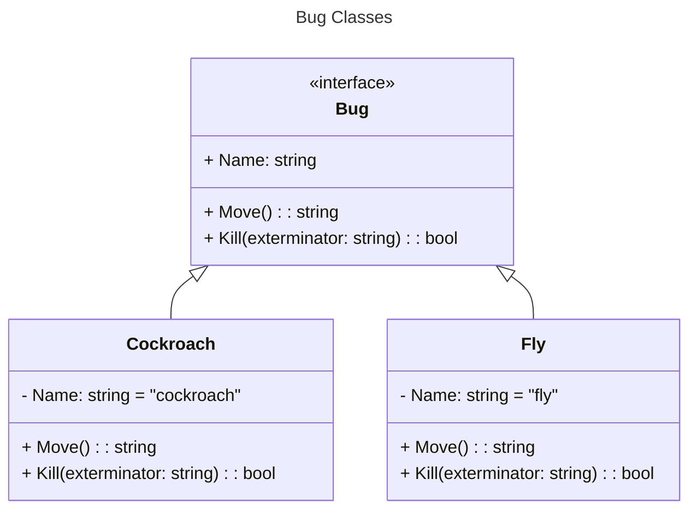

# Example of the Factory Method Design Pattern
A C# console app using .NET 6.0.

## Debugging Game V1
This project is only "inspired" by the [factory method](https://www.dofactory.com/net/factory-method-design-pattern) pattern, since it doesn't use *Creator* classes, instead the objects are created using a switch statement.
The `Bug` classes are analogous to the *Product* classes in the pattern.

### Class Diagram

## Version 2
In this version we add a simple factory class to create the `Bug` objects.
This isn't a full-blown implementation of the pattern, but we're moving in that direction.

